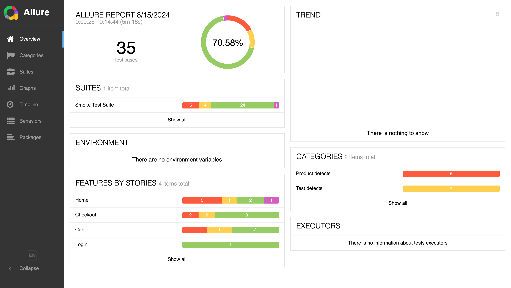
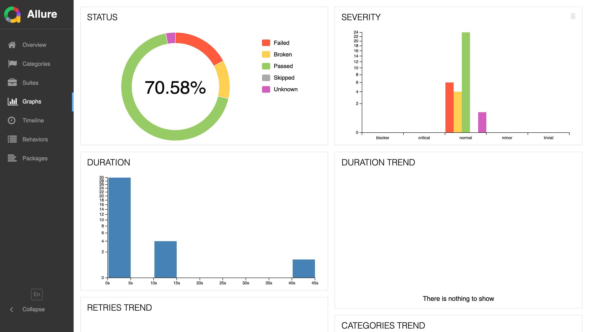
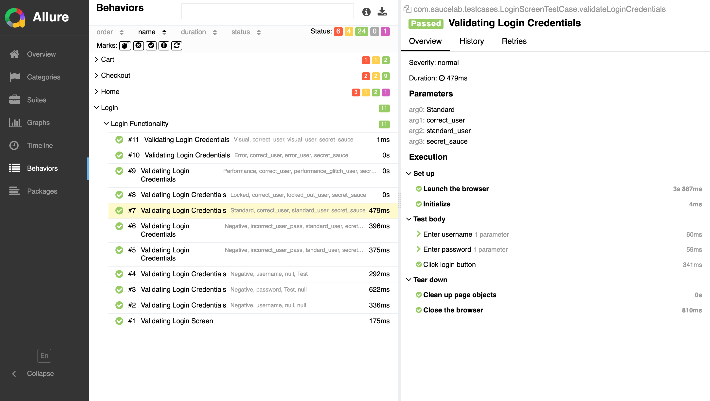
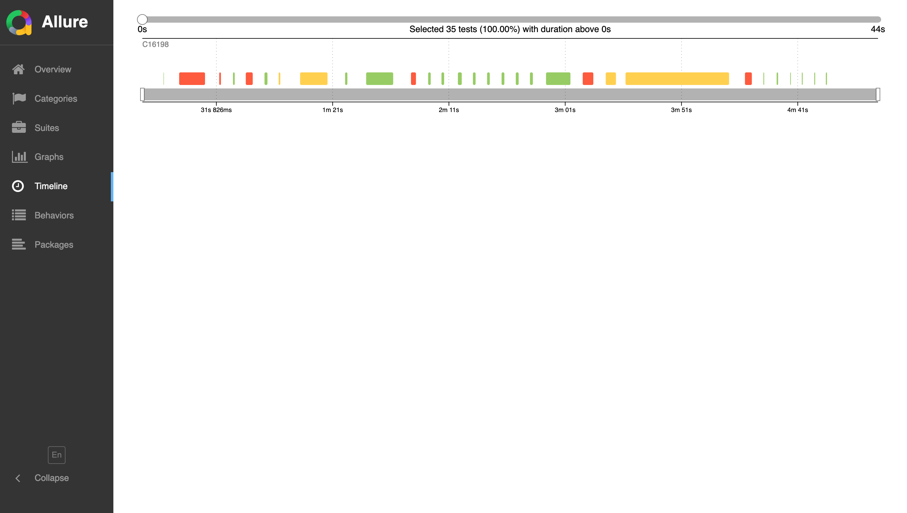

# saucedemo-automation

This project is an automation framework built using Java, Selenium, TestNG, Maven, TDD (Test-Driven Development), and the Page Object Model (POM) design pattern. It is designed to automate the testing of web applications, ensuring a maintainable, scalable, and efficient testing process.

## Table of Contents

- [Project Structure](#project-structure)
- [Prerequisites](#prerequisites)
- [Installation](#installation)
- [Running Tests](#running-tests)
- [Test Reports](#test-reports)

## Project Structure

The project follows a standard Maven structure:

```
src
|-- main
|   |-- java
|       |-- com.saucelab
|           |-- annotations
|           |-- base
|           |-- contants
|           |-- helperUtils
|           |-- listeners
|           |-- pages
|           |-- provider
|           |-- utils
|   |-- resources
|       |-- testData
|-- test
|   |-- java
|       |-- com.saucelab
|           |-- pageTests
```


- **base**: Contains the BaseTest, SetUpDriver, and DriverManager for browser management.
- **pages**: Contains the Page Object Model classes for different web pages.
- **utils**: Contains utility classes such as ScreenshotUtil and ScrollUtil.
- **pageTests**: Contains the TestNG test classes.
- **constants**: Contains constants and copy texts
- **provider**: Test data reader from json and csv files
- **annotations**: Contains customs annotations
- **listeners**: Contains listeners for custom annotations and for saving failed tests screenshot to report

## Prerequisites

- Java 11 or higher
- Maven
- TestNG 7.10.2 or higher
- Selenium 4.21.0 or higher

## Running Tests

1. **To run all pageTests using firefox browser:**
    ```sh
    mvn clean test
    ```

2. **To run by specifying browser:**
    ```sh
   mvn clean test -Dbrowser=firefox
    ```

3. **To run pageTests with a specific test suite with required browser:**
    ```sh
   mvn clean test -DsuiteXmlFile=suites/smoke_testng.xml -Dbrowser=firefox
    ```

## Test Reports

The project uses Allure for test reporting. After running the pageTests, you can generate the Allure reports using the following command:

1. **Generate Allure report:**
    ```sh
    mvn allure:report
    ```

2. **Open Allure report:**
    ```sh
    mvn allure:serve
    ```
   or
   ```shell
   allure serve
   ```

3. **To save report in a single file with report name**
   ```shell
   allure generate -c --single-file allure-results --report-name Allure Report - Firefox
   ```

### Report Screenshots

|  |  |
| ----- | ------ |
|  |     |
|  |    |


